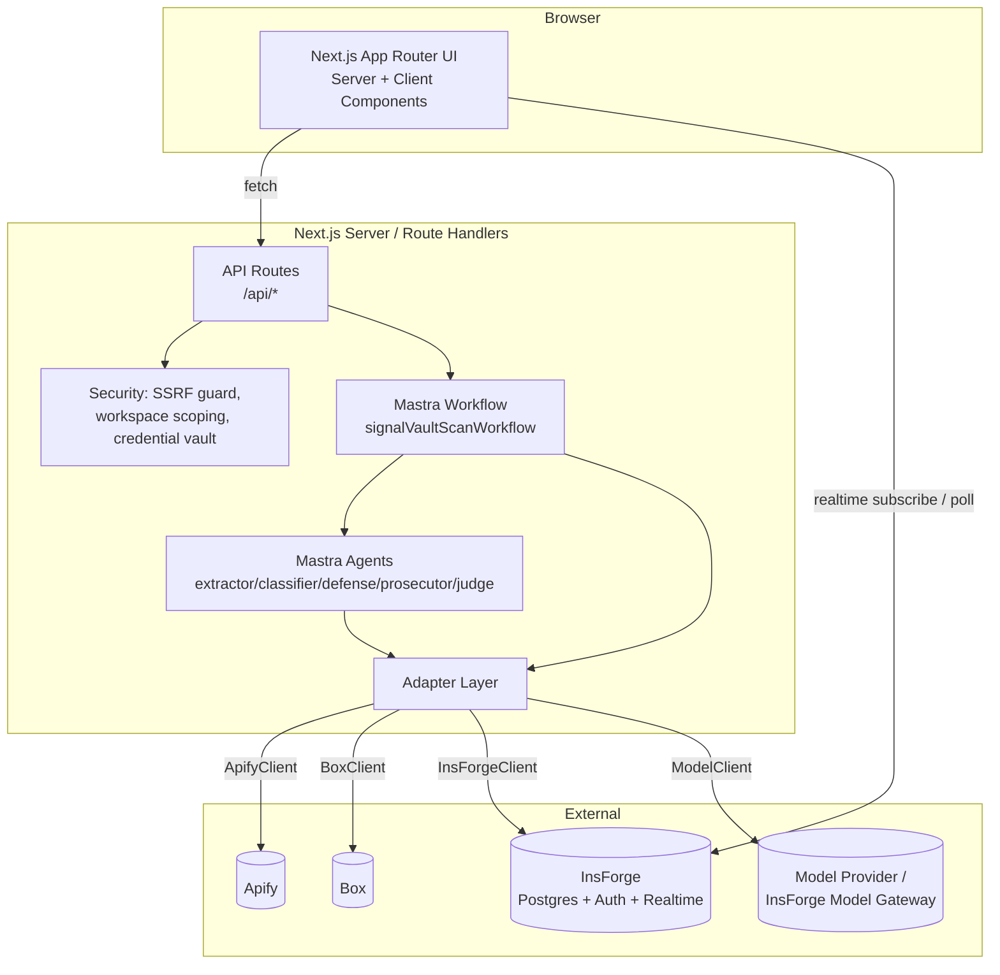
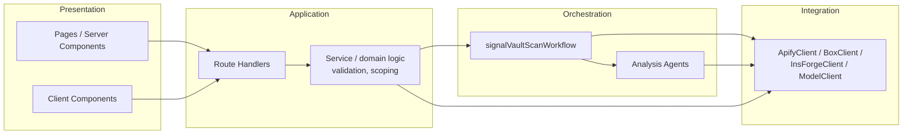
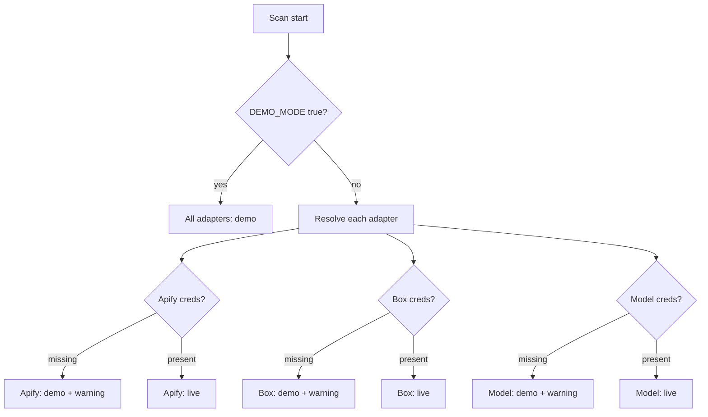
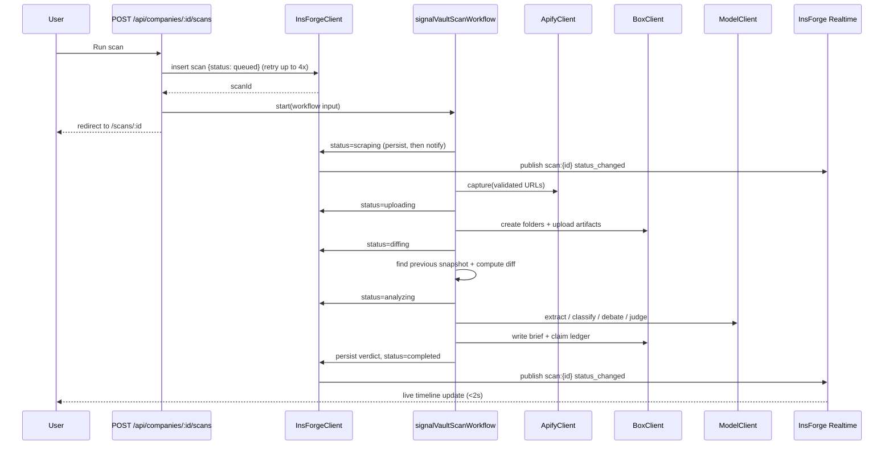
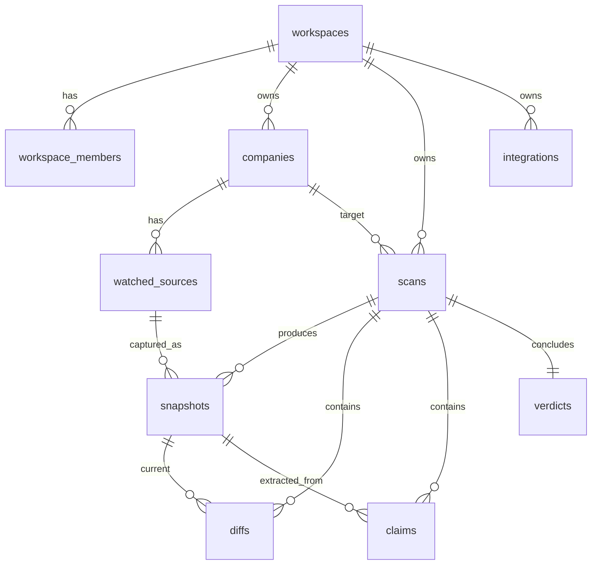

# Design Document

## Overview

SignalVault is a full-stack Next.js (App Router) application that turns public-web changes into auditable market intelligence. A User registers a Company with 3–5 public URLs, runs a Scan, and the system scrapes those pages (Apify), stores evidence in a governed Box folder hierarchy, diffs the current snapshot against the prior one, extracts and classifies public claims, runs a "courtroom" multi-agent debate, and produces a strategy Verdict with a confidence value, a risk score, and recommended actions. Everything is persisted to an InsForge Postgres backend and scoped to a Workspace tenant boundary.

The system is built for a **reliable demo first**. Every external dependency (Apify, Box, the model provider) is reached only through an adapter interface, and each adapter has a deterministic demo/mock implementation that is selected automatically when `DEMO_MODE` is true or when the adapter's credentials are missing. A seeded "Acme AI" Demo_Company demonstrates an upmarket strategy shift with a deterministic Verdict ("Moving upmarket", confidence 82). No external failure may crash the application: every workflow step degrades to a deterministic fallback or skips gracefully.

### Technology Stack

| Concern | Choice | Notes |
| --- | --- | --- |
| Framework | Next.js 14+ (App Router) | Server Components for pages, Route Handlers for the API, server-only code for credentials |
| Language | TypeScript (strict) | Shared Zod schemas across API, workflow, and agents |
| Styling | Tailwind CSS **3.4** + shadcn/ui | Tailwind pinned to 3.4 (do not upgrade to v4) |
| Backend | InsForge (`@insforge/sdk`) | Postgres database, auth, realtime; keys from `.env.local` |
| Orchestration | Mastra | `signalVaultScanWorkflow` workflow + 5 analysis agents |
| Scraping | Apify (via `ApifyClient` adapter) | Mockable |
| Evidence storage | Box (via `BoxClient` adapter) | Governed folder hierarchy, mockable |
| Model inference | OpenAI-compatible provider (via `ModelClient` adapter) | Prefers InsForge Model Gateway; mockable |
| Validation | Zod | Workflow I/O, agent I/O, API request bodies |
| Property testing | fast-check + Vitest | Minimum 100 iterations per property |

### Key Design Principles

1. **Adapters are the only door to the outside world.** No component talks to Apify, Box, InsForge, or the model provider directly (Requirement 23.1). This makes Demo_Mode a per-adapter switch and makes the system testable.
2. **The workflow is deterministic; agents are the only non-deterministic part.** Deterministic steps collect and persist evidence; agents reason only over persisted evidence and perform no side effects (Requirement 23.7).
3. **Workspace scoping is enforced on every query.** Every data access is filtered by the active `workspace_id`, both in API route handlers and in Postgres RLS policies (Requirements 1.4, 21.7).
4. **Degrade, never crash.** Each external call has a timeout, a retry budget, and a deterministic fallback (Requirements 8, 10, 15, 19).
5. **Credentials never reach the browser.** Adapters and credential reads live in server-only modules (Requirement 22).

---

## Architecture

### System Context



### Layered Architecture



The dependency rule points inward-to-outward only through adapters: presentation depends on application, application drives orchestration, and only the integration layer touches external systems. The orchestration and application layers depend on **adapter interfaces**, not concrete implementations, so demo/live selection is a wiring decision.

### Demo / Live Selection

`DEMO_MODE` and per-adapter credential presence are resolved once at scan start into a `RunMode` per adapter. The workflow input carries a single `mode` field (`"demo" | "live"`) for the overall run, but each adapter independently falls back to demo behavior if its own credentials are missing even when the run is nominally live (Requirement 18.2). This means a run can be "live" for InsForge while "demo" for Apify if only the Apify token is absent.



### Scan Execution Sequence



### Realtime With Polling Fallback

Status changes are persisted **before** any progress is emitted (Requirement 7.2). A Postgres trigger on `scans.status` publishes to channel `scan:{scanId}` via `realtime.publish`. The Scan detail client subscribes to that channel and updates the `ScanProgressTimeline` within 2 seconds. If the realtime channel is unavailable (connect/subscribe fails or no event arrives), the client transparently switches to polling `GET /api/scans/:id` at an interval `≤ 5s` until the scan reaches `completed` or `failed` (Requirements 7.3, 7.4).

---

## Components and Interfaces

### Adapter Interfaces

Adapters are the sole access points to external services (Requirement 23.1). Each adapter:

- exposes a narrow TypeScript interface,
- has a **live** implementation and a **demo/mock** implementation,
- exposes `isConfigured()` for missing-credential detection,
- is created by a factory that picks live vs demo based on `DEMO_MODE` and `isConfigured()`,
- is constructed only in server-only modules.

```typescript
// lib/adapters/types.ts
export type RunMode = 'live' | 'demo';

export interface Adapter {
  /** True when all required credentials for live operation are present. */
  isConfigured(): boolean;
  /** Resolved mode for this adapter given DEMO_MODE and credential presence. */
  readonly mode: RunMode;
}
```

#### ApifyClient (Apify_Adapter)

```typescript
export interface CaptureRequest {
  url: string;
  pageRole: SourceType;      // homepage | pricing | docs | ...
  timeoutMs: number;         // <= 60_000
}

export interface CaptureResult {
  url: string;
  pageRole: SourceType;
  ok: boolean;
  rawHtml?: string;
  screenshotRef?: string;    // Apify key-value store ref or mock ref
  simulated: boolean;        // true when demo data was substituted
  skippedReason?: string;    // SSRF rejection, timeout, or upstream failure
}

export interface ApifyClient extends Adapter {
  capture(requests: CaptureRequest[]): Promise<CaptureResult[]>;
}
```

- **Live**: runs an Apify actor per URL, returns raw HTML + screenshot ref within 60s.
- **Demo**: returns seeded snapshot HTML for the Demo_Company sources; `simulated = true`.
- SSRF validation runs **before** the adapter is invoked (in `planWatchTargetsStep`), but the adapter also defensively validates.

#### BoxClient (Box_Adapter)

```typescript
export type ArtifactType =
  | 'raw' | 'normalized' | 'screenshot' | 'diff' | 'claim' | 'report';

export interface BoxFolderSet {
  scanFolderId: string;          // /SignalVault/{Company}/scans/{timestamp}
  subfolders: Record<Exclude<ArtifactType,'screenshot'> | 'screenshots', string>;
  simulated: boolean;
}

export interface BoxUploadResult {
  fileId: string;
  folderId: string;
  url: string;   // persisted alongside key per InsForge storage convention
  key: string;
  simulated: boolean;
}

export interface BoxClient extends Adapter {
  ensureScanFolders(companyName: string, scanTimestamp: string): Promise<BoxFolderSet>;
  upload(folderId: string, artifactType: ArtifactType, name: string, content: Buffer | string): Promise<BoxUploadResult>;
  folderWebLink(folderId: string): string; // used by BoxEvidenceLink (mock links allowed)
}
```

- **Live**: creates `/SignalVault/{Company}/scans/{timestamp}/{raw,normalized,screenshots,diffs,claims,reports}` and uploads to the subfolder matching the artifact type (Requirements 10.1, 10.2).
- **Demo/mock**: returns deterministic mock `fileId`/`folderId`/`url`/`key` values prefixed `mock-`; `simulated = true`.

#### InsForgeClient (InsForge_Adapter)

```typescript
export interface InsForgeClient extends Adapter {
  // Returns a workspace-scoped repository; every query is constrained to workspaceId.
  scoped(workspaceId: string): WorkspaceRepository;
  // Auth / session helpers used by middleware and route handlers.
  getActiveWorkspace(session: Session): Promise<Workspace>;
  // Realtime publish is handled DB-side via triggers; client subscribes.
}

export interface WorkspaceRepository {
  companies: CompanyRepo;
  scans: ScanRepo;
  snapshots: SnapshotRepo;
  diffs: DiffRepo;
  claims: ClaimRepo;
  verdicts: VerdictRepo;
  integrations: IntegrationRepo;
}
```

- All read/write methods accept no cross-workspace inputs; the repository is bound to a single `workspaceId` so callers cannot accidentally query another tenant (Requirements 1.4, 21.7).
- **Demo**: an in-memory store seeded with the Demo_Company when `DEMO_MODE` is true or InsForge credentials are missing (Requirements 18.1, 1.6).

#### ModelClient (Model_Adapter)

```typescript
export interface InferenceRequest {
  system: string;
  messages: { role: 'user' | 'assistant' | 'system'; content: string }[];
  responseSchemaName: string; // for tracing
  timeoutMs: number;          // <= 60_000
}

export interface ModelClient extends Adapter {
  /** Returns raw model text; callers validate against a Zod schema. */
  complete(req: InferenceRequest): Promise<{ text: string; simulated: boolean }>;
}
```

- **Live**: routes to the OpenAI-compatible endpoint at `MODEL_BASE_URL` with `MODEL_API_KEY`. When more than one provider is configured, a fixed precedence prefers the InsForge Model Gateway (Requirements 24.1, 24.2).
- **Demo**: returns deterministic seeded analysis text for the Demo_Company; never makes a network call (Requirement 24.3).
- A 60s timeout marks the request failed and signals the calling step (Requirement 24.4).

### Mastra Workflow: `signalVaultScanWorkflow`

Typed input/output validated with Zod (Requirements 23.2, 23.3). Steps execute in the fixed order below (Requirement 23.4). Each step persists evidence before the next runs, and each step that touches an external service is wrapped with timeout + retry + fallback.

```typescript
// Workflow input (Zod) — Requirement 23.2
const ScanWorkflowInput = z.object({
  companyId: z.string().uuid(),
  companyName: z.string().min(1).max(200),
  companySlug: z.string().min(1),
  workspaceId: z.string().uuid(),
  urls: z.array(z.object({
    url: z.string().url(),
    pageRole: SourceTypeEnum,
  })).min(3).max(5),
  mode: z.enum(['demo', 'live']),
});

// Workflow output (Zod) — Requirement 23.3
const ScanWorkflowOutput = z.object({
  scanId: z.string().uuid(),
  status: z.enum(['completed', 'failed']),
  boxSnapshotFolderId: z.string(),
  changedPages: z.number().int().nonnegative(),
  claimCount: z.number().int().nonnegative(),
  verdict: z.string(),
  confidence: z.number().min(0).max(100),
  briefFileId: z.string(),
});
```

| # | Step | Responsibility | External | Maps to status |
| --- | --- | --- | --- | --- |
| 1 | `createScanStep` | Confirm scan record, set baseline state | InsForge | queued |
| 2 | `planWatchTargetsStep` | Validate URLs, run SSRF guard, build capture plan | — | scraping |
| 3 | `runApifyCaptureStep` | Capture raw HTML + screenshots | Apify | scraping |
| 4 | `normalizeArtifactsStep` | HTML → markdown/text, strip script/nav/footer, hash | — | scraping |
| 5 | `uploadSnapshotToBoxStep` | Create folder tree, upload raw/normalized/screenshots | Box | uploading |
| 6 | `findPreviousSnapshotStep` | Locate prior snapshot per source from last completed scan | InsForge | diffing |
| 7 | `computeDiffStep` | Compute diff, change_score, serialize diff report, upload | Box | diffing |
| 8 | `extractClaimsStep` | `claimExtractorAgent` over normalized content; upload ledger | Model/Box | analyzing |
| 9 | `classifyClaimsStep` | `claimClassifierAgent` assigns Claim_Status | Model | analyzing |
| 10 | `runDebateStep` | defense + prosecutor + judge → Verdict | Model | analyzing |
| 11 | `writeBriefToBoxStep` | Render markdown brief, upload to `reports` | Box | analyzing |
| 12 | `completeScanStep` | Persist verdict, set status completed (or failed) | InsForge | completed |

Each step validates its input/output against a Zod schema before consuming data; a validation failure halts that step without persisting invalid data and surfaces which field failed (Requirements 23.5, 23.6).

### Mastra Agents

All agents reason **only** over evidence persisted by deterministic steps and perform no external side effects (Requirements 13.3, 15.5, 23.7). Every agent output is validated against a Zod schema before use; on validation failure the deterministic fallback is substituted (Requirement 15.7).

| Agent | Input | Output (Zod) | Notes |
| --- | --- | --- | --- |
| `claimExtractorAgent` | normalized content per snapshot | `Claim[]` (type enum, evidence_text, confidence 0–1) | Only emits claims whose `evidence_text` appears in the normalized content (Requirement 13.5); empty allowed (13.6) |
| `claimClassifierAgent` | current claims + prior claims | `ClaimStatus` per claim | No prior snapshot → `new` (14.2); undetermined → `needs_review` (14.3) |
| `defenseAgent` | claims, statuses, diffs | `{ argument, keyEvidence[] }` | Argues changes **support** a strategy shift (15.1) |
| `prosecutorAgent` | claims, statuses, diffs | `{ argument, counterEvidence[] }` | Argues changes **may not** prove a shift; flags ambiguity/weak signals/copy-refresh (15.2) |
| `judgeAgent` | defense + prosecution + evidence | `Verdict` (strategy enum, confidence 0–100 int, risk 0–100 int, 1–10 actions) | `insufficient_evidence` with confidence ≤ 25 when no diffs/statuses (15.6) |

> Note: defense argues **for** a strategy shift; prosecution argues **against** / highlights ambiguity. This matches the corrected requirements.

### API Routes (Route Handlers)

All handlers run server-side, resolve the active Workspace from the session, and use a workspace-scoped repository. Any request targeting a resource outside the active Workspace returns an authorization error — including when the User is a member of the target Workspace but it is not the active one (Requirements 21.7, 1.5).

| Method + Path | Purpose | Key validation |
| --- | --- | --- |
| `POST /api/companies` | Create Company + 3–5 Watched_Sources | name 1–200, valid hostname, 3–5 unique valid http(s) URLs, each a source type (Req 4) |
| `GET /api/companies` | List companies in active Workspace | alpha order handled by UI/query (Req 3.1) |
| `GET /api/companies/:id` | Company + sources + most recent scan/verdict/claims | scope check (Req 21.2) |
| `POST /api/companies/:id/sources` | Add Watched_Source | valid http(s) URL + source type (Req 5.6, 5.7) |
| `POST /api/companies/:id/scans` | Create scan (retry ≤4) and start workflow | Req 6 |
| `GET /api/scans/:id` | Scan status + snapshots + diffs + claims + verdict + artifacts | scope check (Req 21.5) |
| `POST /api/integrations/apify` | Store Apify integration config (encrypted/mock) | Req 21.6, 22 |
| `POST /api/integrations/box` | Store Box integration config (encrypted/mock) | Req 21.6, 22 |

Standard error envelope:

```typescript
type ApiError = { error: { code: string; message: string; field?: string } };
// codes: VALIDATION, UNAUTHORIZED, FORBIDDEN, NOT_FOUND, CONFLICT, INTERNAL
```

### Pages (App Router)

| Route | Type | Content |
| --- | --- | --- |
| `/` | Public | Landing: product name + tagline, integration strip (Apify, Box, Mastra, InsForge), example brief card, nav to dashboard (Req 2) |
| `/companies` | Protected | Dashboard: `CompanyCard` grid alpha-ordered, empty state, add control (Req 3) |
| `/companies/new` | Protected | `AddCompanyForm` (Req 4) |
| `/companies/[id]` | Protected | Detail: header, `WatchedSourcesTable`, scan history, `RunScanButton`, latest complete results (Req 5) |
| `/scans/[id]` | Protected | Scan detail: `ScanProgressTimeline`, results regions, evidence (Req 7, 17) |

Unauthenticated access to a protected route redirects to the auth flow without rendering protected content or returning scoped data (Requirement 1.1), enforced in middleware. In Demo_Mode a default Workspace is provided so the flow proceeds without external auth (Requirement 1.6).

### UI Components

| Component | Responsibility | Requirements |
| --- | --- | --- |
| `CompanyCard` | name, domain, source count, latest scan status/time, verdict + risk, not-yet-scanned state | 3.2, 3.6, 3.7 |
| `RunScanButton` | start a scan, navigate to scan detail | 5.4, 6.1, 6.7 |
| `ScanProgressTimeline` | render ordered statuses with labels; live + polling | 7.1, 7.3, 7.4 |
| `WatchedSourcesTable` | list sources with URL + type | 5.1 |
| `EvidenceArtifactList` | one entry per artifact: type + Box location; empty state | 17.4, 17.5 |
| `DiffViewer` | change_summary, added_text, removed_text; deserialize error placeholder | 11.4, 12.4 |
| `ClaimLedger` | table of claims: text, type, status, risk, confidence, source, evidence | 14.4 |
| `ClaimStatusBadge` | colored status badge (new=blue, removed=gray, weakened=orange, contradicted=red, strengthened=green, needs_review=yellow) | 14.5 |
| `RiskBadge` | risk score 0–100 | 16.3 |
| `StrategyVerdictCard` | strategy prediction + confidence | 16.2 |
| `CourtroomAnalysis` | defense, prosecution, judge; omit unavailable parts | 15.4 |
| `BoxEvidenceLink` | link to Box_Evidence_Folder (mock links allowed) | 10.6 |
| `AddCompanyForm` | name/domain + 3–5 URL rows with source type; inline validation | 4 |

---

## Data Models

### InsForge Postgres Schema

All domain tables carry `workspace_id` (directly or via parent) so every query can be workspace-scoped, and RLS policies enforce it independently of application code. Inserts use array form; users are referenced via `auth.users(id)` (per InsForge conventions). Timestamps default to `now()`.



```sql
-- workspaces
CREATE TABLE workspaces (
  id uuid PRIMARY KEY DEFAULT gen_random_uuid(),
  name text NOT NULL,
  is_demo boolean NOT NULL DEFAULT false,
  created_at timestamptz NOT NULL DEFAULT now()
);

-- workspace_members (User <-> Workspace, with role)
CREATE TABLE workspace_members (
  id uuid PRIMARY KEY DEFAULT gen_random_uuid(),
  workspace_id uuid NOT NULL REFERENCES workspaces(id) ON DELETE CASCADE,
  user_id uuid NOT NULL REFERENCES auth.users(id) ON DELETE CASCADE,
  role text NOT NULL CHECK (role IN ('owner','admin','member')),
  created_at timestamptz NOT NULL DEFAULT now(),
  UNIQUE (workspace_id, user_id)
);

-- companies
CREATE TABLE companies (
  id uuid PRIMARY KEY DEFAULT gen_random_uuid(),
  workspace_id uuid NOT NULL REFERENCES workspaces(id) ON DELETE CASCADE,
  name text NOT NULL CHECK (char_length(name) BETWEEN 1 AND 200),
  domain text NOT NULL,
  slug text NOT NULL,
  created_at timestamptz NOT NULL DEFAULT now()
);

-- watched_sources
CREATE TABLE watched_sources (
  id uuid PRIMARY KEY DEFAULT gen_random_uuid(),
  company_id uuid NOT NULL REFERENCES companies(id) ON DELETE CASCADE,
  url text NOT NULL,
  source_type text NOT NULL CHECK (source_type IN
    ('homepage','pricing','docs','changelog','trust','careers','terms','privacy','status','blog')),
  created_at timestamptz NOT NULL DEFAULT now()
);

-- scans
CREATE TABLE scans (
  id uuid PRIMARY KEY DEFAULT gen_random_uuid(),
  workspace_id uuid NOT NULL REFERENCES workspaces(id) ON DELETE CASCADE,
  company_id uuid NOT NULL REFERENCES companies(id) ON DELETE CASCADE,
  status text NOT NULL CHECK (status IN
    ('queued','scraping','uploading','diffing','analyzing','completed','failed')),
  trigger_type text NOT NULL DEFAULT 'manual',
  failure_reason text,
  box_scan_folder_id text,
  created_at timestamptz NOT NULL DEFAULT now(),
  updated_at timestamptz NOT NULL DEFAULT now()
);

-- snapshots (raw/normalized/screenshot evidence refs + hashes)
CREATE TABLE snapshots (
  id uuid PRIMARY KEY DEFAULT gen_random_uuid(),
  scan_id uuid NOT NULL REFERENCES scans(id) ON DELETE CASCADE,
  watched_source_id uuid NOT NULL REFERENCES watched_sources(id) ON DELETE CASCADE,
  raw_artifact_url text, raw_artifact_key text, raw_box_file_id text,
  normalized_artifact_url text, normalized_artifact_key text, normalized_box_file_id text,
  screenshot_artifact_url text, screenshot_artifact_key text, screenshot_box_file_id text,
  content_hash text,          -- hash of raw HTML
  normalized_text_hash text,  -- hash of normalized content
  simulated boolean NOT NULL DEFAULT false,
  created_at timestamptz NOT NULL DEFAULT now()
);

-- diffs
CREATE TABLE diffs (
  id uuid PRIMARY KEY DEFAULT gen_random_uuid(),
  scan_id uuid NOT NULL REFERENCES scans(id) ON DELETE CASCADE,
  prior_snapshot_id uuid REFERENCES snapshots(id) ON DELETE SET NULL,
  current_snapshot_id uuid NOT NULL REFERENCES snapshots(id) ON DELETE CASCADE,
  change_score int NOT NULL CHECK (change_score BETWEEN 0 AND 100),
  change_summary text NOT NULL,
  added_text text NOT NULL DEFAULT '',
  removed_text text NOT NULL DEFAULT '',
  modified_sections jsonb NOT NULL DEFAULT '[]',
  diff_box_file_id text,
  created_at timestamptz NOT NULL DEFAULT now()
);

-- claims
CREATE TABLE claims (
  id uuid PRIMARY KEY DEFAULT gen_random_uuid(),
  scan_id uuid NOT NULL REFERENCES scans(id) ON DELETE CASCADE,
  snapshot_id uuid NOT NULL REFERENCES snapshots(id) ON DELETE CASCADE,
  claim_type text NOT NULL CHECK (claim_type IN
    ('pricing','packaging','security','compliance','feature','integration',
     'social_proof','hiring','terms','positioning')),
  statement_text text NOT NULL,
  evidence_text text NOT NULL,
  confidence numeric NOT NULL CHECK (confidence BETWEEN 0.0 AND 1.0),
  claim_status text CHECK (claim_status IN
    ('new','removed','weakened','contradicted','strengthened','needs_review')),
  risk_level text,
  created_at timestamptz NOT NULL DEFAULT now()
);

-- verdicts
CREATE TABLE verdicts (
  id uuid PRIMARY KEY DEFAULT gen_random_uuid(),
  scan_id uuid NOT NULL REFERENCES scans(id) ON DELETE CASCADE,
  workspace_id uuid NOT NULL REFERENCES workspaces(id) ON DELETE CASCADE,
  strategy_prediction text NOT NULL CHECK (strategy_prediction IN
    ('moving_upmarket','enterprise_readiness','pricing_tightening',
     'security_posture_change','messaging_pivot','self_serve_push','insufficient_evidence')),
  confidence int NOT NULL CHECK (confidence BETWEEN 0 AND 100),
  risk_score int NOT NULL CHECK (risk_score BETWEEN 0 AND 100),
  recommended_actions jsonb NOT NULL,   -- 1..10 entries
  key_evidence jsonb NOT NULL DEFAULT '[]',
  counter_evidence jsonb NOT NULL DEFAULT '[]',
  is_fallback boolean NOT NULL DEFAULT false,
  created_at timestamptz NOT NULL DEFAULT now()
);

-- integrations
CREATE TABLE integrations (
  id uuid PRIMARY KEY DEFAULT gen_random_uuid(),
  workspace_id uuid NOT NULL REFERENCES workspaces(id) ON DELETE CASCADE,
  provider text NOT NULL CHECK (provider IN ('Apify','Box')),
  credential_ciphertext text,   -- encrypted (live) or mock placeholder (demo)
  is_mock boolean NOT NULL DEFAULT false,
  created_at timestamptz NOT NULL DEFAULT now(),
  UNIQUE (workspace_id, provider)
);
```

RLS: every domain table has policies that require the row's `workspace_id` (or its parent's) to be in the set of the caller's member workspaces, with the active workspace enforced at the application layer as well.

### Box Folder Structure

```
/SignalVault/{Company}/scans/{timestamp}/
  ├── raw/          (raw HTML artifacts)
  ├── normalized/   (normalized markdown)
  ├── screenshots/  (page screenshots)
  ├── diffs/        (diff report artifacts)
  ├── claims/       (claim ledger)
  └── reports/      (final brief markdown)
```

`{timestamp}` uniquely identifies the Scan. Each uploaded artifact persists its returned Box `fileId` and `folderId` (plus `url`/`key`) on the related DB record. When credentials are unavailable, mock identifiers (`mock-...`) are stored and a "simulated storage" warning is surfaced (Requirements 10.3, 10.5).

### Diff Report Serialization Model

The diff report artifact is the serialized form of a computed Diff (Requirement 12). It must round-trip: serialize → deserialize yields an equivalent Diff (same prior/current snapshot references, same set of detected changes, identical DiffViewer rendering).

```typescript
// Canonical in-memory Diff used by the DiffViewer.
interface Diff {
  priorSnapshotId: string | null;
  currentSnapshotId: string;
  changeScore: number;             // int 0..100
  changeSummary: string;
  addedText: string;
  removedText: string;
  modifiedSections: ModifiedSection[];
}
interface ModifiedSection { heading: string; before: string; after: string; }

// Serialized artifact (stored in Box diffs/ and referenced from DB).
interface DiffReportArtifact {
  version: 1;
  priorSnapshotId: string | null;
  currentSnapshotId: string;
  changeScore: number;
  changeSummary: string;
  addedText: string;
  removedText: string;
  modifiedSections: ModifiedSection[];
}

function serializeDiff(d: Diff): string;            // -> JSON string
function deserializeDiff(s: string): Diff;          // throws on malformed
```

Equivalence for the round-trip property is defined on the canonical fields and on the rendered DiffViewer output (a pure function of the Diff), not on byte-identical JSON.

### Shared Zod Schemas (source of truth)

```typescript
const SourceTypeEnum = z.enum(['homepage','pricing','docs','changelog','trust',
  'careers','terms','privacy','status','blog']);
const ClaimTypeEnum = z.enum(['pricing','packaging','security','compliance','feature',
  'integration','social_proof','hiring','terms','positioning']);
const ClaimStatusEnum = z.enum(['new','removed','weakened','contradicted','strengthened','needs_review']);
const StrategyEnum = z.enum(['moving_upmarket','enterprise_readiness','pricing_tightening',
  'security_posture_change','messaging_pivot','self_serve_push','insufficient_evidence']);

const ClaimSchema = z.object({
  claimType: ClaimTypeEnum,
  statementText: z.string().min(1),
  evidenceText: z.string().min(1),
  confidence: z.number().min(0).max(1),
});
const VerdictSchema = z.object({
  strategyPrediction: StrategyEnum,
  confidence: z.number().int().min(0).max(100),
  riskScore: z.number().int().min(0).max(100),
  recommendedActions: z.array(z.string().min(1)).min(1).max(10),
  keyEvidence: z.array(z.string()),
  counterEvidence: z.array(z.string()),
});
```

---

## Correctness Properties

*A property is a characteristic or behavior that should hold true across all valid executions of a system — essentially, a formal statement about what the system should do. Properties serve as the bridge between human-readable specifications and machine-verifiable correctness guarantees.*

These properties were derived from the acceptance-criteria prework. Each is universally quantified and is intended to be implemented as a single property-based test running a minimum of 100 iterations.

### Property 1: Workspace scoping excludes other tenants

*For any* collection of workspaces each owning companies, scans, snapshots, diffs, claims, and verdicts, and *for any* chosen active workspace, every record returned by the workspace-scoped repository has a `workspace_id` (directly or via its parent) equal to the active workspace, and no record belonging to any other workspace is ever returned.

**Validates: Requirements 1.4**

### Property 2: Cross-workspace access is denied without leakage or mutation

*For any* resource that belongs to a workspace other than the active workspace, a request for that resource returns an authorization error, returns no attribute of the requested resource, and leaves the requested resource and all workspace data unchanged.

**Validates: Requirements 1.5, 21.7**

### Property 3: Authentication establishes exactly one active workspace

*For any* user with N ≥ 0 workspace memberships, after the active-workspace resolution the session has exactly one active workspace; when N = 0 a workspace and a corresponding owner membership are created and selected.

**Validates: Requirements 1.2, 1.3**

### Property 4: Dashboard ordering is case-insensitive ascending and lossless

*For any* set of companies, the dashboard ordering function returns the same multiset of companies arranged in case-insensitive ascending order by name.

**Validates: Requirements 3.1**

### Property 5: Valid Add Company creates one company and one source per URL

*For any* Add Company submission with a name of 1–200 characters, a syntactically valid hostname, and 3–5 distinct valid HTTP/HTTPS URLs each assigned a source type, creation produces exactly one company record and exactly one watched-source record per submitted URL in the active workspace.

**Validates: Requirements 4.1, 4.2, 4.7**

### Property 6: Invalid Add Company is rejected atomically

*For any* Add Company submission that violates a rule (fewer than 3 or more than 5 URLs, a non-HTTP/HTTPS URL, an empty or over-200-character name, an invalid hostname, or a duplicated URL), the submission is rejected with a validation message identifying the offending field, and no company or watched-source records are persisted.

**Validates: Requirements 4.3, 4.4, 4.5, 4.6, 4.8**

### Property 7: SSRF guard blocks internal address ranges and admits public hosts

*For any* URL whose host resolves to a loopback (127.0.0.0/8 or ::1), private IPv4 (10.0.0.0/8, 172.16.0.0/12, 192.168.0.0/16), link-local (169.254.0.0/16 or fe80::/10), or unique-local IPv6 (fc00::/7) address, the SSRF guard rejects the URL; *for any* URL whose host resolves to a public address, the guard admits it.

**Validates: Requirements 8.2**

### Property 8: Capture yields one result per source and never throws on skips

*For any* set of watched sources mixing admissible and rejected URLs, the capture step returns exactly one result per source, marks each rejected source as skipped with a recorded reason, returns results for the remaining valid sources, and completes without raising.

**Validates: Requirements 8.3, 8.4, 8.7**

### Property 9: Apify failure or missing credentials produces simulated snapshots and continues

*For any* set of watched sources, when the Apify adapter is uncredentialed, errors, throws, or times out, every affected source receives demo snapshot data flagged `simulated = true` and the workflow proceeds to the next step.

**Validates: Requirements 8.6, 19.1**

### Property 10: Normalization removes script, navigation, and footer content

*For any* raw HTML containing script, navigation, and footer elements with identifiable marker text, the normalized content contains none of those markers.

**Validates: Requirements 9.2**

### Property 11: Content hashing is deterministic

*For any* snapshot content, the content hash and normalized-text hash are deterministic functions of their inputs — equal inputs always produce equal hashes across repeated computations.

**Validates: Requirements 9.4**

### Property 12: Box artifacts are routed to the type-matched subfolder

*For any* set of evidence artifacts uploaded for a scan, the folder set contains exactly the six subfolders (raw, normalized, screenshots, diffs, claims, reports) and each artifact is uploaded into the subfolder matching its type (raw HTML→raw, normalized→normalized, screenshot→screenshots, diff→diffs, claim ledger→claims, brief→reports).

**Validates: Requirements 10.1, 10.2**

### Property 13: Uploaded artifact identifiers round-trip to persistence

*For any* uploaded evidence artifact, the persisted record's stored Box file identifier, folder identifier, url, and key equal the values returned by the Box adapter.

**Validates: Requirements 10.3**

### Property 14: Box failure or missing credentials yields mock identifiers and continues

*For any* set of artifacts, when the Box adapter is uncredentialed, errors, throws, or times out, the affected records are persisted with mock storage identifiers and the workflow proceeds to the next step.

**Validates: Requirements 10.5, 19.2**

### Property 15: Prior snapshot selection picks the most recent earlier completed scan

*For any* company scan history, the previous-snapshot lookup selects, for each watched source, at most one prior snapshot, and that snapshot belongs to the most recently completed scan strictly earlier than the current scan; if none exists, no prior snapshot is selected.

**Validates: Requirements 11.1**

### Property 16: change_score is bounded and zero iff content is identical

*For any* pair of prior and current normalized contents, the computed `change_score` is an integer in [0, 100], and it equals 0 if and only if the prior and current normalized contents are identical.

**Validates: Requirements 11.2**

### Property 17: Diff serialization round-trips

*For any* computed Diff, deserializing the artifact produced by serializing that Diff yields a Diff that references the same prior snapshot and current snapshot, contains the same set of detected changes, and renders identical content in the DiffViewer as the original Diff.

**Validates: Requirements 12.1, 12.2, 12.3**

### Property 18: Extracted claims conform to the typed claim schema

*For any* normalized snapshot content, every claim returned by the extractor has a `claim_type` drawn from the defined enum, a non-empty `evidence_text`, and a confidence value in [0.0, 1.0].

**Validates: Requirements 13.1**

### Property 19: Extracted claims are grounded in the normalized content

*For any* extractor output over a snapshot, every retained claim's `evidence_text` occurs within that snapshot's normalized content, and no claim unsupported by that content is emitted.

**Validates: Requirements 13.5**

### Property 20: Classification assigns exactly one valid status with defined defaults

*For any* set of current and prior claims, the classifier assigns each claim exactly one `Claim_Status` from the defined enum; a claim whose watched source has no prior snapshot is assigned `new`; a claim whose status cannot be determined is assigned `needs_review`.

**Validates: Requirements 14.1, 14.2, 14.3**

### Property 21: Judge verdict satisfies all bounds and cardinality

*For any* debate inputs, an accepted judge Verdict has a `strategy_prediction` from the defined enum, an integer `confidence` in [0, 100], an integer `risk_score` in [0, 100], and between 1 and 10 recommended actions.

**Validates: Requirements 15.3, 16.1**

### Property 22: Absent evidence forces an insufficient-evidence verdict

*For any* debate input in which no diffs were computed and no claim was assigned a status, the judge produces the `insufficient_evidence` strategy prediction with a confidence value not exceeding 25.

**Validates: Requirements 15.6**

### Property 23: Model failure or invalid agent output yields the deterministic fallback verdict

*For any* agent output that fails its Zod schema validation, or *for any* model invocation that errors, throws, times out, or is uncredentialed, the system substitutes the deterministic Demo_Company fallback verdict and the workflow continues to the completed status.

**Validates: Requirements 15.7, 19.3, 24.3**

### Property 24: Scan creation honors the retry budget

*For any* schedule of scan-record creation failures, the system makes at most 4 attempts; if an attempt succeeds within the budget exactly one scan record is created and the workflow is started; if all 4 attempts fail no scan record is persisted and no workflow is started.

**Validates: Requirements 6.2, 6.3**

### Property 25: Status is persisted before any progress is emitted

*For any* sequence of scan status transitions, every emitted progress update of a status value is preceded by a persisted write of that same status value to the scan record.

**Validates: Requirements 7.2**

### Property 26: Partial results render available elements and placeholder the rest

*For any* subset of scan-result elements that have available data, the scan detail rendering displays the data for every present element and a placeholder for every absent element, without any element blocking the others.

**Validates: Requirements 17.2**

### Property 27: Demo Mode is deterministic across repeated scans

*For any* number of repeated Demo_Mode scans of the Demo_Company, the produced snapshots, claims, claim statuses, and verdict are identical across runs.

**Validates: Requirements 18.7**

### Property 28: Credentials never leak to the browser

*For any* integration credential value and *for any* HTTP response delivered to the browser, the response body and headers exclude the unmasked production credential value; a Demo_Mode placeholder is never equal to a production credential value; and a stored live credential's persisted value is never equal to its plaintext.

**Validates: Requirements 22.2, 22.4, 22.5**

### Property 29: Schema validation gates step and agent consumption

*For any* workflow input, agent input, or agent output that violates its Zod schema, the affected step rejects the data, persists nothing from it, and surfaces which field failed; any input satisfying its schema is accepted.

**Validates: Requirements 23.5, 23.6**

### Property 30: Model routing prefers the InsForge Model Gateway

*For any* set of configured inference providers that includes the InsForge Model Gateway, the Model adapter selects the InsForge Model Gateway as the single provider for each request.

**Validates: Requirements 24.2**

---

## Error Handling

The system follows a **degrade-never-crash** discipline. Failures are classified and handled at the layer that owns the failing concern.

### Failure Taxonomy and Responses

| Failure | Layer | Response | Requirement |
| --- | --- | --- | --- |
| Unauthenticated access to protected route | Middleware | Redirect to auth, render nothing scoped | 1.1 |
| Cross-workspace request | Route handler + RLS | `FORBIDDEN`, no attributes, no mutation | 1.5, 21.7 |
| Add Company validation error | Route handler | `VALIDATION` with field, persist nothing | 4.3–4.6, 4.8 |
| Scan record creation fails | Route handler | Retry ≤ 4 attempts; on exhaustion `INTERNAL`, no workflow | 6.2, 6.3 |
| Workflow start fails after scan created | Route handler | Set scan `failed`, error message | 6.5 |
| SSRF-rejected URL | `planWatchTargetsStep` | Skip source, record reason, continue | 8.2, 8.3 |
| Apify error/timeout/missing creds | `runApifyCaptureStep` | Demo snapshots, `simulated` warning, continue | 8.6, 19.1 |
| Per-source scrape failure | `runApifyCaptureStep` | Skip source, record reason, continue | 8.7 |
| Normalization failure/empty output | `normalizeArtifactsStep` | Store raw text, record reason, continue | 9.5 |
| Box error/timeout/missing creds | `uploadSnapshotToBoxStep` | Mock IDs, `simulated` warning, continue | 10.5, 19.2 |
| Box ID persistence failure | `uploadSnapshotToBoxStep` | Retry ≤ 3, record cause, continue (do not terminate) | 10.4 |
| Diff computation failure | `computeDiffStep` | Record cause, exclude that source, continue | 11.6 |
| Diff serialization failure | `computeDiffStep` | Record cause, omit that diff artifact, continue | 12.5 |
| Diff artifact malformed/missing on load | `DiffViewer` | Error message for that diff, render rest of page | 12.4 |
| Agent output fails Zod / model failure | `runDebateStep` | Deterministic fallback verdict, continue to completed | 15.7, 19.3 |
| Verdict persistence failure | `completeScanStep` | Retry ≤ 3; on exhaustion record cause + error message | 16.6 |
| Unrecoverable step failure (no fallback in ≤ 3) | Workflow | Set scan `failed`, retain prior evidence, show failing step | 7.6, 19.5 |
| Dashboard/company-detail load failure | Page | Error + retry control, no partial/stale cards | 3.8, 5.8 |

### Retry and Timeout Conventions

- External calls use a 60-second timeout (Apify, Box, Model) after which the call is treated as failed (Requirements 8.1, 19.1–19.3, 24.4).
- Recoverable steps attempt a fallback within at most 3 attempts before escalating to a terminal `failed` state (Requirements 19.4, 19.5).
- Persistence retries: scan creation ≤ 4 total attempts (6.2), Box ID persistence ≤ 3 (10.4), verdict persistence ≤ 3 (16.6).
- Every failure records a cause string; for terminal failures the failing workflow step is surfaced on the scan detail page (7.6).

### Result Aggregation

Steps return a `StepResult` carrying `{ data, warnings[], skipped[] }`. Warnings (simulated Apify/Box/Model, skipped sources) accumulate through the workflow and are surfaced on the scan detail page so a partially-simulated scan is transparent to the user.

---

## Testing Strategy

SignalVault uses a dual testing approach: **property-based tests** for universal invariants and **example/integration tests** for specific scenarios, UI rendering, and timing behavior.

### Property-Based Testing

- **Library**: `fast-check` driven by **Vitest** (TypeScript). Property-based testing is not implemented from scratch.
- **Iterations**: each property test runs a minimum of **100** iterations.
- **Coverage**: one property-based test per property in the Correctness Properties section (Properties 1–30).
- **Tagging**: each test is tagged with a comment referencing its design property, in the format:
  `// Feature: signalvault, Property {number}: {property_text}`
- **Generators**: custom `fast-check` arbitraries for workspaces/companies/scans/snapshots, HTML documents (with script/nav/footer elements and special characters), normalized-content pairs, IP addresses across each blocked and public CIDR range, Diff values, claim sets, and debate inputs. Adapters are exercised through their interfaces with in-memory/mock implementations so property runs stay fast and offline.
- **Focus areas** (highest value): Property 17 (diff serialization round-trip — explicitly required by Requirement 12), Property 7 (SSRF guard), Property 1/2 (workspace isolation), Property 16 (change_score bounds), Property 19 (claim grounding), Property 21/22 (verdict bounds and conditional), Property 27 (demo determinism), Property 28 (credential non-leakage).

### Example-Based Unit Tests

For criteria that are specific scenarios rather than universal properties:

- Landing page renders the product name, tagline, and the integration strip in order Apify, Box, Mastra, InsForge (Requirements 2.1, 2.6).
- Demo verdict equals "Moving upmarket" with confidence 82 (Requirement 18.5).
- Status-to-label mapping and lifecycle ordering (Requirement 7.1).
- CompanyCard not-yet-scanned state (Requirement 3.7).
- Normalization empty-output fallback to raw text (Requirement 9.5).
- Diffing baseline branch when no prior snapshot exists (Requirement 11.3).
- Empty claim extraction returns `[]` without failing (Requirement 13.6).
- Malformed diff artifact shows an error and renders the rest of the page (Requirement 12.4).

### Component / Snapshot Tests

UI components are verified with React Testing Library and snapshot tests (not PBT): `ClaimStatusBadge` color mapping (14.5), `RiskBadge` (16.3), `StrategyVerdictCard` (16.2), `DiffViewer` (11.4), `ClaimLedger` (14.4), `CourtroomAnalysis` partial rendering (15.4), `BoxEvidenceLink` (10.6), and `EvidenceArtifactList` empty state (17.5).

### Integration Tests

A small number of integration tests (1–3 examples each) verify wiring that does not benefit from many iterations:

- End-to-end Demo_Mode scan: run `signalVaultScanWorkflow` for Acme AI and assert it reaches `completed` with the seeded verdict and all evidence artifacts recorded.
- Realtime → polling fallback: with the realtime channel disabled, the timeline still advances via polling at an interval ≤ 5s (Requirement 7.4).
- Live-adapter smoke tests (Apify, Box, Model) guarded behind credential presence; skipped in CI when credentials are absent.

### Timing-Sensitive Behavior

Latency requirements (landing placeholder within 5s — 2.2; timeline update within 2s — 7.3, 7.5; company detail within 10s — 5.8; scan detail within 3s — 17.3) are validated with example/integration tests using fake timers rather than property-based tests, since they assert timing rather than input-varying logic.
